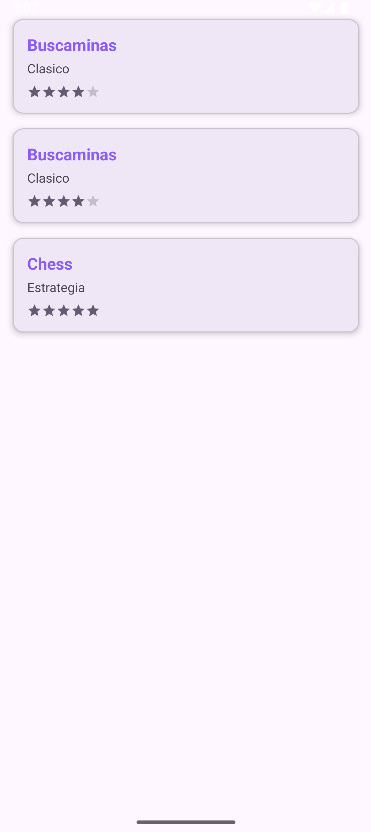

# 🎮 App S10 - Gestor de Videojuegos con Firebase

Esta es una aplicación Android desarrollada en **Kotlin** que permite a los usuarios registrarse, iniciar sesión y gestionar una lista personalizada de videojuegos. Utiliza **Firebase Authentication** para el acceso de usuarios y **Firebase Realtime Database** para almacenar los datos de los juegos.

---

## 🚀 Funcionalidades

- 🔐 Autenticación de usuarios (registro, login y logout).
- 👤 Detección de usuario actual y bienvenida personalizada.
- ➕ Guardar videojuegos con título, género y puntuación (rating).
- 📋 Ver lista de juegos agregados por el usuario autenticado.
- 🌐 Integración con Firebase (Auth y Realtime Database).

---

## 🧪 Tecnologías utilizadas

- Kotlin
- Android Jetpack: ConstraintLayout, RecyclerView, CardView
- Firebase Authentication
- Firebase Realtime Database
- Material Components

---

## 📱 Pantallas principales

- **LoginActivity:** Inicio de sesión con correo y contraseña.
- **MainActivity:** Pantalla principal con opciones de navegación.
- **AddGameActivity:** Formulario para agregar un nuevo videojuego.
- **GamesListActivity:** Lista de juegos almacenados por el usuario actual.

---

## 🖼️ Capturas de pantalla

### 🔐 Login  

### 🧭 Pantalla Principal  

### 📝 Agregar Juego  

### 📋 Lista de Juegos  

